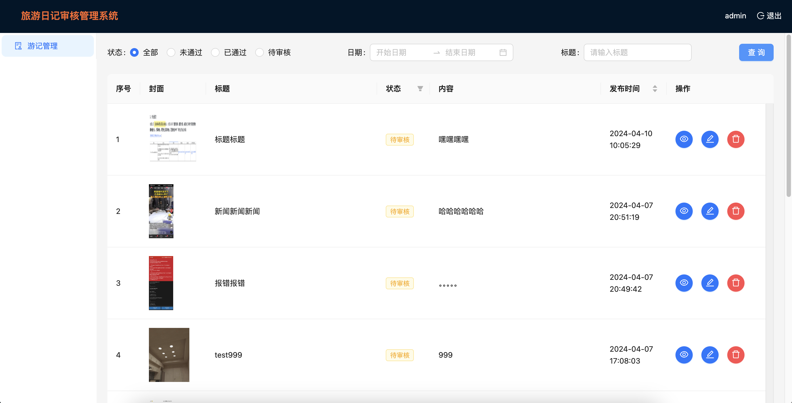

# 项目介绍

这是一个使用 CRA 构建的 [Create React App](https://github.com/facebook/create-react-app)简单应用。
项目是一个旅游日记平台的审核管理系统，审核管理系统为一个 PC 站点，不同角色可以对用户发布的游记做上线前的查看、审核、删除等操作。

# 项目技术栈

- React
- React-router
- Redux
- Antd
- Axios
- Mockjs

# 项目功能

- 实现用户登录
- 游记管理：展示所有用户发布的游记列表，可以对游记进行查看、审核、删除等操作。审核人员可以进行游记的审核通过和拒绝；管理员可以执行所有支持的操作 （ 通过、拒绝、删除）；拒绝需要提交拒绝理由。
- 两种角色：审核人员和管理员
- 支持通过不同的游记状态、发布时间、游记标题做筛选过滤
- 支持分页功能

# 项目启动

1. 进入项目目录 `cd travel_admin`
2. 安装依赖 `npm install`
3. 启动项目 `npm start`

在开发模式下运行应用。\
打开 [http://localhost:3000](http://localhost:3000) 在浏览器中查看。

做出更改时，页面将重新加载。\

# 项目截图

- 登录页面
  

- 游记管理页面
  

- 游记详情页面
  

- 审核拒绝
  

- 审核通过
  
