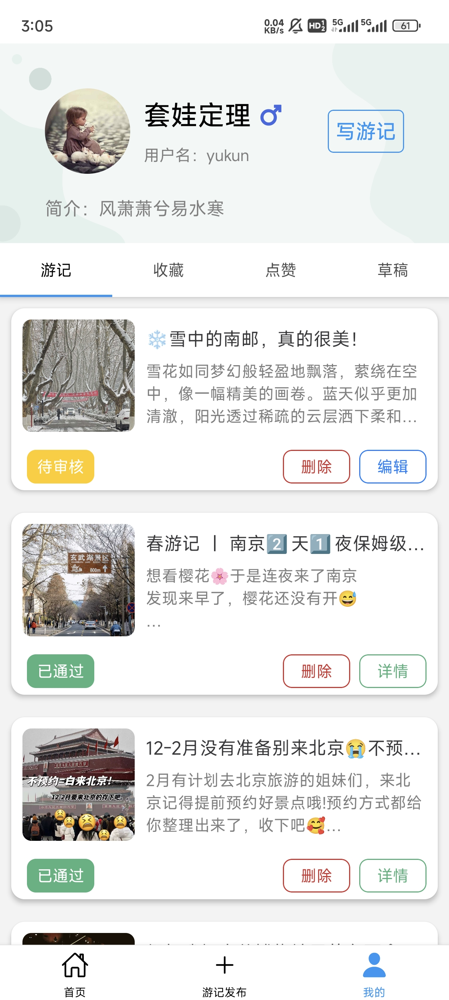
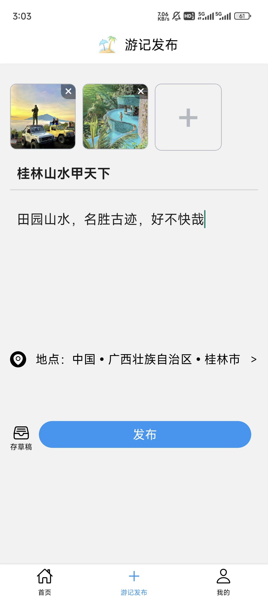
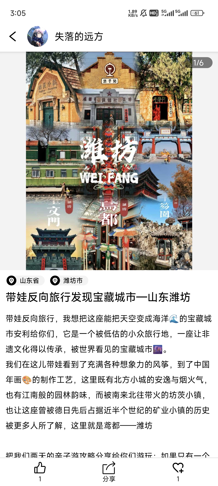
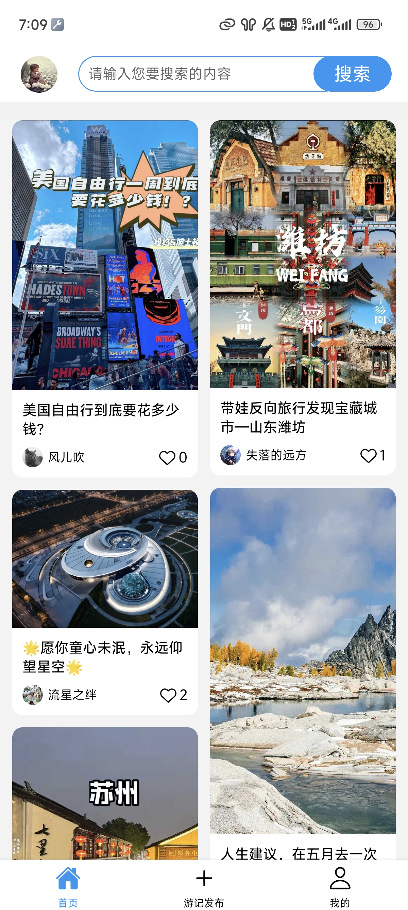
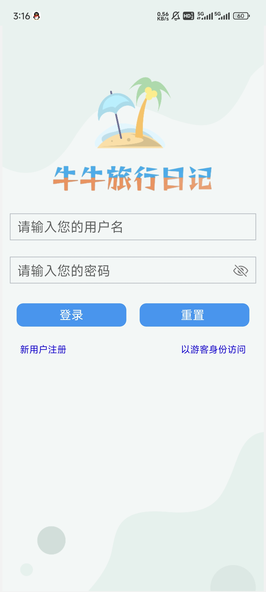
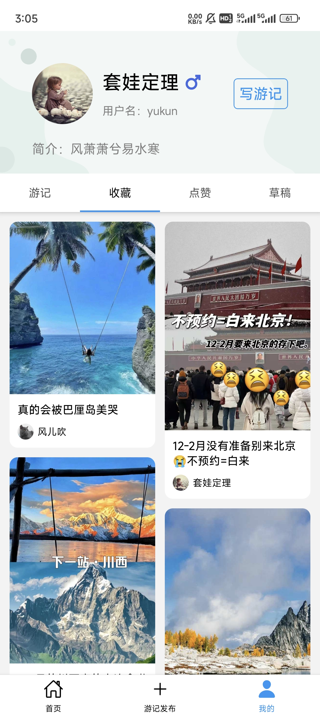
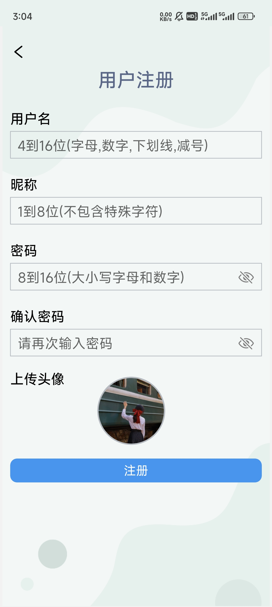

# 项目介绍

“牛牛旅行日记”是一个基于 Expo 平台和 React Native 开发的用户移动端 APP 项目。该项目旨在为用户提供一个便利的平台，可以记录和分享自己的旅行经历，并与其他用户交流和分享旅行灵感。

# 项目技术栈

### 1. Expo

- **简介：** Expo 是一个开源工具链，用于构建 React Native 应用程序。它提供了许多工具和服务，可以加速应用程序的开发和部署过程。
- **特点：**
  - **快速开发：** Expo 提供了丰富的开发工具和预构建组件，可以帮助开发者快速构建跨平台的移动应用。
  - **自动部署：** Expo 提供了自动构建和部署功能，可以直接将应用程序部署到 Expo 云端服务器，并生成应用程序的安装链接。
  - **热重载：** Expo 支持热重载功能，可以在开发过程中实时预览和调试应用程序的变化。

### 2. React Native

- **简介：** React Native 是 Facebook 推出的一个基于 React 的跨平台移动应用开发框架。它允许开发者使用 JavaScript 和 React 的语法来构建原生移动应用。
- **特点：**
  - **组件化开发：** React Native 使用组件化的开发模式，允许开发者通过组合和封装组件来构建复杂的用户界面。
  - **跨平台：** React Native 支持跨平台开发，可以使用相同的代码库构建 iOS 和 Android 应用程序，并实现原生级别的性能和体验。
  - **原生模块：** React Native 允许开发者使用原生模块和原生代码扩展应用程序的功能，实现与设备硬件和系统的交互。

### 3. Redux

- **简介：** Redux 是一个用于管理应用程序状态的 JavaScript 库。它提供了一个可预测的状态容器，用于存储应用程序的状态，并通过一种统一的方式来管理状态的变化。
- **特点：**
  - **单一数据源：** Redux 使用单一数据源来存储应用程序的状态，使状态的管理变得简单和可预测。
  - **纯函数操作：** Redux 使用纯函数来描述状态的变化，通过纯函数操作来更新状态，确保状态变化的可追踪性和可测试性。
  - **中间件支持：** Redux 支持中间件来处理异步操作和副作用，例如网络请求和日志记录等。

### 4. React Navigation

- **简介：** React Navigation 是一个用于管理 React Native 应用程序导航的库。它提供了一套灵活的导航组件和 API，用于实现应用程序的导航和页面跳转功能。
- **特点：**
  - **路由配置：** React Navigation 允许开发者通过路由配置来定义应用程序的导航结构和路由跳转规则。
  - **可定制性：** React Navigation 提供了丰富的导航组件和 API，支持自定义导航栏、页面切换效果和手势操作等功能。
  - **跨平台兼容：** React Navigation 支持 iOS 和 Android 平台，并提供了相似的 API 和使用体验。

### 5. Axios

- **简介：** Axios 是一个基于 Promise 的 HTTP 客户端，用于在浏览器和 Node.js 环境中发送 HTTP 请求。
- **特点：**
  - **简单易用：** Axios 提供了简洁的 API，可以轻松地发送 GET、POST、PUT、DELETE 等类型的 HTTP 请求。
  - **支持拦截器：** Axios 支持拦截器功能，可以在请求和响应过程中插入自定义的逻辑，例如添加请求头、处理错误等。
  - **Promise API：** Axios 使用 Promise API 来处理异步操作，使得代码的编写更加简洁和易读。

### 6. React Native Paper

- **简介：** React Native Paper 是一个基于 Material Design 的 UI 组件库，专为 React Native 应用程序设计。
- **特点：**
  - **Material Design：** React Native Paper 遵循 Material Design 设计规范，提供了一系列符合 Material Design 样式的 UI 组件。
  - **易用性：** React Native Paper 提供了简单易用的 UI 组件，可以帮助开发者快速构建符合 Material Design 样式的用户界面。
  - **可定制性：** React Native Paper 支持自定义主题和样式，可以根据项目的需求进行灵活定制和扩展。

# 主要页面

### 1. 登录页

- **描述：** 登录页用于已注册用户登录APP，用户需要输入正确的用户名和密码才能成功登录，并进入APP的首页。当用户还没有创建账号时可以进入注册页进行创建。

### 2. 注册页

- **描述：** 还未创建账号的用户可以进入注册页，填写必要的个人信息并通过系统校验，创建新的账户。

### 3. 首页

- **描述：** 首页是APP的主界面，通过瀑布流卡片动态展示了用户可能感兴趣的旅行日记。用户可以在首页浏览最新的旅行日记、搜索想要浏览的旅行日记。也可以点击相应的游记卡片进入详情页浏览该旅行日记的详细内容。
- **主要组件：** React Native Waterfall Flow ：一个用于 React Native 应用程序的瀑布流布局组件库，可以帮助开发者实现常见的瀑布流布局效果。它支持响应式布局、自定义配置、无限滚动、手势操作，并经过了高性能优化，能够在大数据量情况下保持流畅。

### 4. 详情页

- **描述：** 详情页展示了单篇旅行日记的详细内容，包括轮播图展示的多张游记图片、地理位置信息、标题、内容描述、发布时间、点赞数和收藏数等。用户可以在详情页查看、点赞以及收藏旅行日记，同时还可以将游记的内容分享到其他平台上。
- **主要组件：** react native pager view ：一个 React Native 轮播图组件库。可以帮助开发者快速实现图片轮播等功能。该库支持多种自定义配置选项，包括轮播速度、轮播方向、指示器样式等。

### 5. 编辑发布页

- **描述：** 编辑发布页用于用户创建和编辑自己的旅行日记。用户可以在此页面添加标题内容、上传照片、选择地理位置等，并将旅行日记发布到平台上与其他用户分享，还没准备好发布时也支持先存到草稿箱。

### 6. 我的页

- **描述：** 我的页面采用了选项卡组件，选项包括游记、收藏、点赞和草稿。我的游记展示了当前登录用户的个人旅行日记，用户可以在此页面查看自己发布的旅行日记的状态、可以对游记进行删除抑或是重新编辑。我的收藏和我的点赞展示了用户收藏和点赞的旅行日记，用户可以点击详情查看游记的详细内容，我的草稿保存了用户还没有准备好发布的游记内容，并支持继续编辑。
- **主要组件：** react native collapsible tab view ：一个 React Native 选项卡组件库。可以帮助开发者轻松创建具有选项卡式导航的界面，支持水平和垂直方向的标签页导航，还支持顶部的用户信息折叠效果，并提供流畅的动画效果。开发者可以通过简单的 API 自定义标签页的外观、布局和交互效果，以满足不同项目的需求。

# 项目启动

1. 克隆项目到本地`git clone https://github.com/yukun1230/travels.git`
2. 在手机上安装Expo Go或者安装Android Studio模拟器
3. 进入项目目录 `cd travels_mobile`
4. 安装依赖 `yarn install`
5. 启动项目 `yarn start`
6. 链接调试设备：使用手机Expo Go扫描二维码；或者打开Android Studio模拟器，终端控制台运行`a`

# 项目截图

